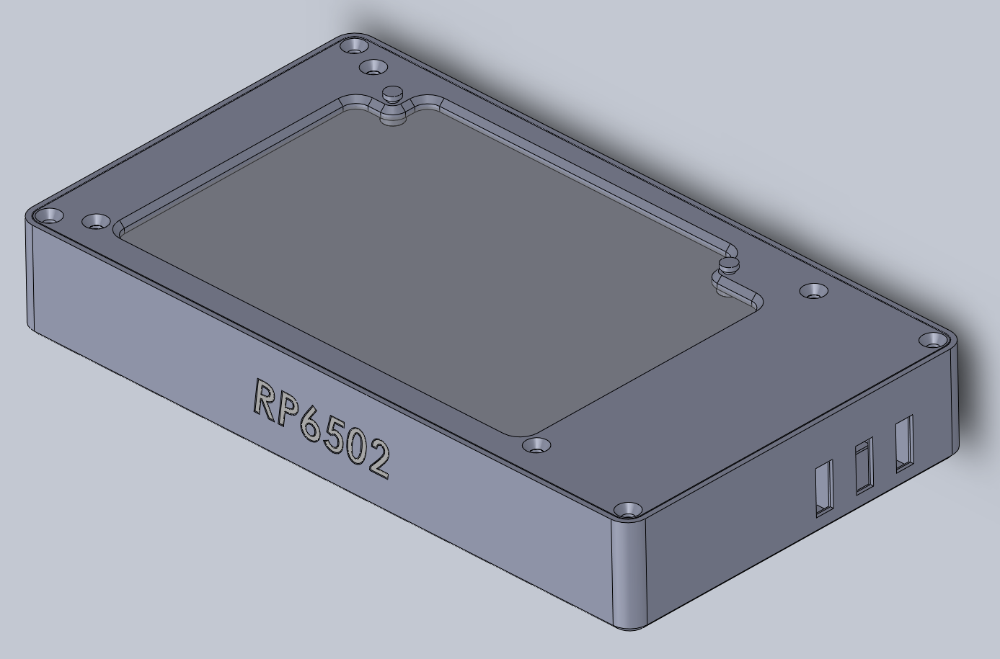

# RP6502-Cases
3D-Printed cases to protect and enhance your [Picocomputer 6502](https://picocomputer.github.io/)

#### rp6502 directory: A case for the circuit board alone

 

#### rp6502_hub directory: A case for the board and USB hub

 

#### rp6502_hub_video_audio directory: A case for board, hub, speakers, display, and optional battery

 
